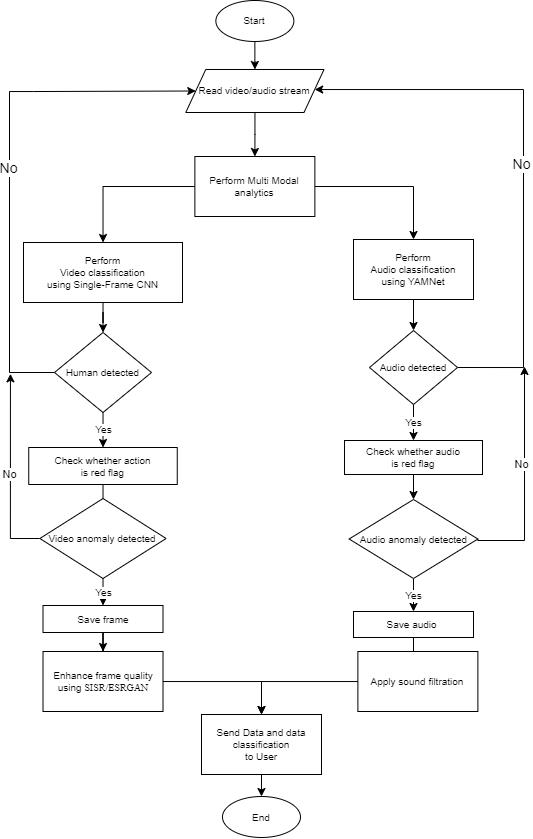

# Real-Time Audio and Video Processing

This Python script performs real-time audio and video processing using various deep learning models. It processes live video and audio streams, performs action recognition, object detection, and audio classification. The script interacts with Azure BLOB storage for image and video uploading and uses Twilio API for notifications.


## Architecture 
<p align="center">
    
</p>
<p align="center">
    
</p>


## Project Setup

Clone the project

```bash
  git clone https://github.com/Dev-R/multi-modal-classification.git
```

Go to the project directory

```bash
  cd multi-modal-classification
```

### Create virtualenv

```bash
virtualenv env
```

### Activate virtualenv (Windows)

```bash
env/Scripts/activate
```

### Install dependencies

```bash
pip install -r requirements.txt
```


## Environment Variables

To run this project, you will need to add the following environment variables to your .env file

```sh 
    # Twilio Config
    # Read more at http://twil.io/secure
    FROM_PHONE_NUMBER=your_from_phone_number # Receiver phone number +1xxxxxxxxxx
    ACCOUNT_SID=your_account_sid # Twilio account sid
    AUTH_TOKEN=your_auth_token # Twilio auth token
    MESSAGE_TEMPLATE=your_message_template # Twilio message template
    MESSAGE_SERVICE_ID=your_message_service_id # Twilio message service id

    # Azure BLOB Config
    CONNECT_STR=your_azure_connection_string # Azure connection string
    IMAGE_CONTAINER_NAME=your_image_container_name # Azure image container name
    VIDEO_CONTAINER_NAME=your_video_container_name # Azure video container name
    AZURE_STORGE_ACCOUNT=your_azure_storage_account # Azure storage account name

    # SMS and Notifications will be sent to this number
    TO_PHONE_NUMBER=your_to_phone_number # Twillio phone number +1xxxxxxxxxx
```


## Run Locally

Run the main Python script:

```bash
  python main.py [OPTIONS]
```
Replace [OPTIONS] with any of the available command-line options described below.

### Command-Line Options
 - -n or --normal: Activate normal mode for video processing.
- -i or --ip: Stream video from an IP camera.
- -c or --accuracy: Activate accuracy mode for video processing.
- -v or --video: Stream a local video file.

### Examples 

To run the script in normal mode using a web camera:

```bash
  python main.py -n
```

To stream video from an IP camera with accuracy mode:

```bash
  python main.py -i -c
```

To process a local video file:

```bash
  python main.py -v
```

## Notes
- The script processes both audio and video streams in real-time using deep learning models.

- The audio classification uses YAMNet model for classifying audio events.

- The video processing includes action recognition and object detection using trained deep learning models.

- Detected anomalies trigger notifications via Twilio API.

- The script interacts with Azure BLOB storage for uploading images and videos.

- Adjust the parameters and paths in the script according to your project structure.


## Acknowledgements

 - [Real-ESRGAN - Image Improvement](https://github.com/sberbank-ai/Real-ESRGAN)
 - [YAMNet - Audio Classification](https://github.com/tensorflow/models/tree/master/research/audioset/yamnet)
 - [Single Frame CNN - Video Classification](https://bulldogjob.com/news/449-how-to-write-a-good-readme-for-your-github-project)


## Contributing

Feel free to contribute to this project by opening an issue or submitting a pull request.


## License

[MIT](https://choosealicense.com/licenses/mit/)

